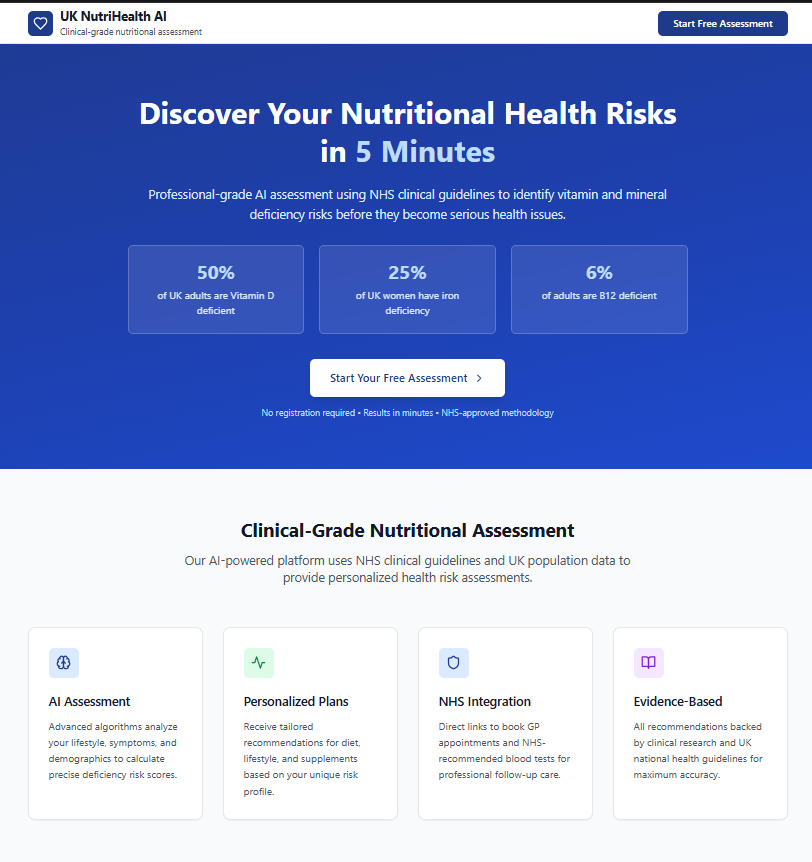
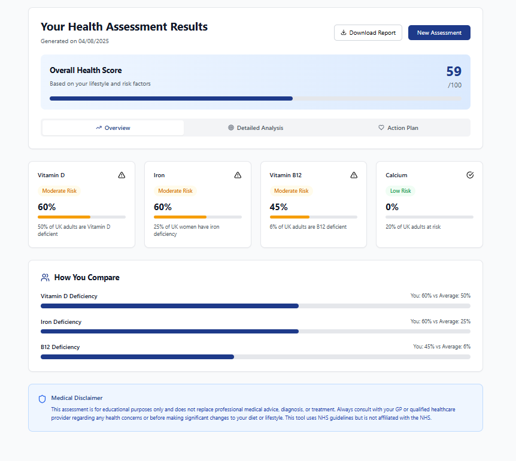
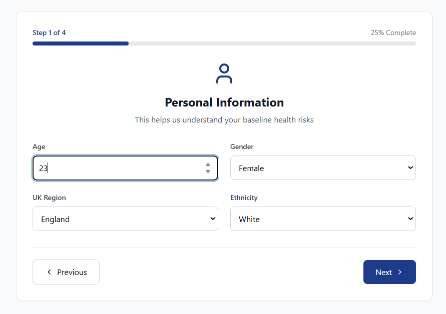
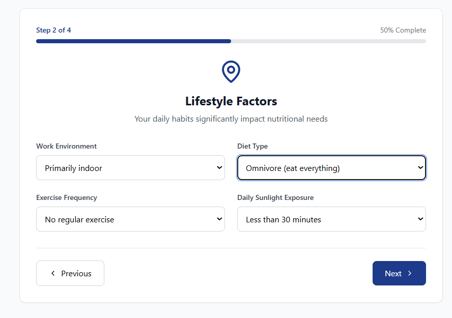
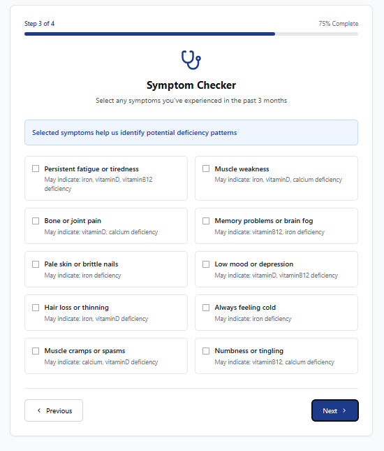
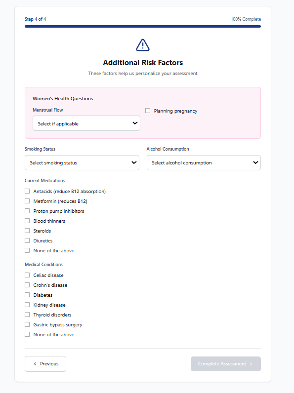

# UK NutriHealth AI 🏥

> **Professional-grade nutritional health assessment platform using NHS clinical guidelines and AI-powered risk analysis**

[](https://opensource.org/licenses/MIT)
[](https://www.typescriptlang.org/)
[](https://reactjs.org/)
[](https://tailwindcss.com/)

## 🌟 Overview

UK NutriHealth AI is a comprehensive health assessment platform that identifies vitamin and mineral deficiency risks using advanced algorithms and NHS clinical guidelines. The platform provides personalized recommendations to help prevent nutritional deficiencies before they become serious health issues.

### 📊 Key Statistics
- **50%** of UK adults are Vitamin D deficient
- **25%** of UK women have iron deficiency  
- **6%** of adults are B12 deficient
- **£300-800** average NHS treatment cost per deficiency case

## 🚀 Live Demo

**[🔗 View Live Demo →](https://beamish-kashata-836ad2.netlify.app/)**

Experience the full functionality of UK NutriHealth AI with our interactive demo. Complete the 4-step assessment and receive your personalized health risk analysis.

## 📱 Demo Screenshots

### Landing Page & Introduction

*Professional NHS-style interface with clear value proposition*

### Assessment Results Dashboard

*Comprehensive risk analysis with traffic light system*

### Step-by-Step Assessment Flow
 | 
:-------------------------:|:-------------------------:
*Demographics Collection* | *Lifestyle Analysis*

 | 
:-------------------------:|:-------------------------:
*Symptom Checker* | *Risk Factors Assessment*

## ✨ Features

### 🎯 Core Functionality
- **AI-Powered Risk Assessment** - Advanced algorithms analyze lifestyle, symptoms, and demographics
- **4-Step Smart Assessment** - Dynamic branching with personalized questions
- **Comprehensive Results Dashboard** - Traffic light system with detailed risk analysis
- **Evidence-Based Recommendations** - NHS-approved guidelines and clinical research
- **Professional Report Generation** - Downloadable health assessment reports

### 🏥 Healthcare Integration
- **NHS-Style Design** - Professional medical-grade user interface
- **Clinical Accuracy** - Based on UK national health guidelines
- **GP Integration** - Direct links to book appointments and request tests
- **GDPR Compliant** - Secure data handling and privacy protection

### 📱 User Experience
- **Mobile-Responsive Design** - Optimized for all devices
- **Accessibility Compliant** - WCAG 2.1 AA standards
- **Progress Tracking** - Save and monitor health improvements
- **Interactive Visualizations** - Risk comparisons and health scores

## 🏗️ System Architecture

The UK NutriHealth AI platform follows a modern, scalable architecture designed for healthcare applications:

### Frontend Architecture
```
┌─────────────────────────────────────────────────────────────────┐
│                    UK NutriHealth AI Frontend                   │
├─────────────────────────────────────────────────────────────────┤
│  React 18 + TypeScript + Tailwind CSS + Vite                   │
│                                                                 │
│  ┌─────────────────┐  ┌─────────────────┐  ┌─────────────────┐ │
│  │  Landing Page   │  │   Assessment    │  │     Results     │ │
│  │   Component     │  │    Flow (4      │  │   Dashboard     │ │
│  │                 │  │     Steps)      │  │                 │ │
│  └─────────────────┘  └─────────────────┘  └─────────────────┘ │
│                                                                 │
│  ┌─────────────────────────────────────────────────────────────┐ │
│  │           Risk Assessment Engine (Client-Side)             │ │
│  │  - Vitamin D Risk Calculator                               │ │
│  │  - Iron Deficiency Analysis                                │ │
│  │  - B12 Deficiency Assessment                               │ │
│  │  - Calcium Risk Evaluation                                 │ │
│  └─────────────────────────────────────────────────────────────┘ │
└─────────────────────────────────────────────────────────────────┘
```

### Project Structure
```
uk-nutrihealth-ai/
├── demo/                    # Demo screenshots and assets
│   ├── intro.png           # Landing page screenshot
│   ├── result.png          # Results dashboard
│   ├── step1.png           # Assessment step 1
│   ├── step2.png           # Assessment step 2
│   ├── step3.png           # Assessment step 3
│   └── step4.png           # Assessment step 4
├── src/
│   ├── components/         # React components
│   │   ├── LandingPage.tsx # Hero section and features
│   │   ├── Assessment.tsx  # 4-step assessment flow
│   │   └── Results.tsx     # Results dashboard
│   ├── data/              # Health data and statistics
│   │   └── healthData.ts  # UK health conditions and symptoms
│   ├── types/             # TypeScript definitions
│   │   └── index.ts       # Core type definitions
│   ├── utils/             # Utility functions
│   │   └── riskCalculator.ts # Risk assessment algorithms
│   └── App.tsx            # Main application component
├── README.md              # Project documentation
├── package.json           # Dependencies and scripts
└── vite.config.ts         # Build configuration
```

## 🛠️ Technology Stack

- **Frontend**: React 18 + TypeScript
- **Styling**: Tailwind CSS
- **Icons**: Lucide React
- **Build Tool**: Vite
- **Deployment**: Netlify
- **Code Quality**: ESLint + TypeScript

## 📋 Assessment Process

### Step 1: Demographics
- Age, gender, UK region, ethnicity
- Baseline risk factor identification

### Step 2: Lifestyle Analysis  
- Work environment and sunlight exposure
- Diet type and exercise frequency
- Environmental risk factors

### Step 3: Symptom Checker
- Interactive symptom selection
- Condition matching (fatigue→iron, bone pain→vitamin D)
- Clinical correlation analysis

### Step 4: Risk Factors
- Smart branching questions
- Gender-specific assessments
- Medical history and medications

## 📊 Risk Assessment Algorithm

The platform uses a sophisticated scoring system based on clinical research:

```typescript
const calculateRiskAssessment = (profile: UserProfile): RiskAssessment => {
  // Vitamin D Risk Factors
  let vitaminDRisk = 0;
  
  // Regional factors (Scotland higher risk)
  if (profile.region === 'scotland') vitaminDRisk += 30;
  
  // Work environment impact
  if (profile.workEnvironment === 'indoor') vitaminDRisk += 25;
  
  // Sunlight exposure correlation
  if (profile.sunlightExposure === '<30min') vitaminDRisk += 20;
  
  // Ethnicity considerations
  if (profile.ethnicity === 'black' || profile.ethnicity === 'asian') vitaminDRisk += 15;
  
  return { vitaminD: Math.min(vitaminDRisk, 95), ... };
};
```

## 🎨 Design System

### Color Palette
- **Primary**: `#003087` (NHS Blue)
- **Secondary**: `#ffffff` (Clinical White)
- **Success**: `#16a34a` (Low Risk Green)
- **Warning**: `#d97706` (Medium Risk Amber)
- **Danger**: `#dc2626` (High Risk Red)

### Typography
- **Headings**: Inter (Bold, 600-700 weight)
- **Body**: Inter (Regular, 400-500 weight)
- **Code**: JetBrains Mono

## 🚀 Getting Started

### Prerequisites
- Node.js 18+ 
- npm or yarn

### Installation

1. **Clone the repository**
   ```bash
   git clone https://github.com/shivas1432/UK-NutriHealth-AI.git
   cd UK-NutriHealth-AI
   ```

2. **Install dependencies**
   ```bash
   npm install
   ```

3. **Start development server**
   ```bash
   npm run dev
   ```

4. **Open in browser**
   ```
   http://localhost:5173
   ```

### Build for Production

```bash
npm run build
npm run preview
```

## 📈 Health Conditions Covered

| Condition | UK Prevalence | Risk Factors | NHS Cost |
|-----------|---------------|--------------|----------|
| **Vitamin D Deficiency** | 50% of adults | Indoor work, limited sunlight, darker skin | £150-400 |
| **Iron Deficiency Anemia** | 25% of women | Heavy periods, vegetarian diet, pregnancy | £200-500 |
| **Vitamin B12 Deficiency** | 6% of adults | Vegan diet, age 50+, absorption issues | £100-300 |
| **Calcium Deficiency** | 20% at risk | Age 50+, low dairy, sedentary lifestyle | £300-800 |

## 🔒 Privacy & Compliance

- **GDPR Compliant** - Full data protection compliance
- **No Personal Data Storage** - Client-side processing only
- **Medical Disclaimers** - Clear educational purpose statements
- **NHS Guidelines** - Based on official health recommendations

## 🤝 Contributing

We welcome contributions! Please see our [Contributing Guidelines](CONTRIBUTING.md) for details.

### Development Workflow
1. Fork the repository
2. Create a feature branch (`git checkout -b feature/amazing-feature`)
3. Commit changes (`git commit -m 'Add amazing feature'`)
4. Push to branch (`git push origin feature/amazing-feature`)
5. Open a Pull Request

## 📄 License

This project is licensed under the MIT License - see the [LICENSE](LICENSE) file for details.

## ⚠️ Medical Disclaimer

**Important**: This platform is for educational purposes only and does not replace professional medical advice, diagnosis, or treatment. Always consult with your GP or qualified healthcare provider regarding any health concerns. This tool uses NHS guidelines but is not affiliated with the NHS.

## 📞 Support

- **Issues**: [GitHub Issues](https://github.com/shivas1432/UK-NutriHealth-AI/issues)
- **Discussions**: [GitHub Discussions](https://github.com/shivas1432/UK-NutriHealth-AI/discussions)
- **Demo**: [Live Application](https://beamish-kashata-836ad2.netlify.app/)

## 🙏 Acknowledgments

- **NHS** - Clinical guidelines and health statistics
- **UK Government** - National health data and research
- **Medical Research Community** - Evidence-based recommendations
- **Open Source Community** - Tools and libraries used

---

<div align="center">

**Built with ❤️ for better health outcomes in the UK**

[Live Demo](https://beamish-kashata-836ad2.netlify.app/) • [Documentation](https://github.com/shivas1432/UK-NutriHealth-AI/wiki) • [Report Bug](https://github.com/shivas1432/UK-NutriHealth-AI/issues)

</div>
